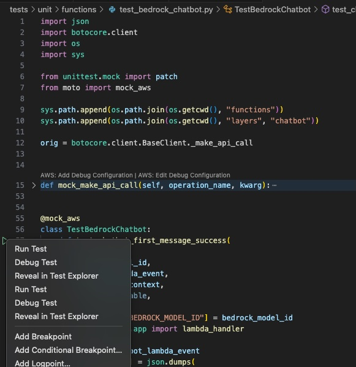

# Serverless Chatbot
This is a **sample** chatbot API using AWS services that I will use to illustrate a number of concepts and approaches through a series of blog posts.  Over time I plan to extend and enhance the solution further.


## Prerequisites

Before you begin, ensure you have the following tools and resources available:

1. **Python 3.13**: This project requires Python 3.13 or later. You can download it from [python.org](https://www.python.org/downloads/).
   - On macOS, you can install Python using Homebrew: `brew install python@3.13`

2. **AWS Account**: You'll need an AWS account with access to the following services:
   - Amazon Bedrock
   - AWS Lambda
   - Amazon DynamoDB
   - Amazon API Gateway

3. **AWS CLI**: Configure the AWS CLI with your credentials to interact with AWS services. Install and configure it by following the [AWS CLI User Guide](https://docs.aws.amazon.com/cli/latest/userguide/cli-configure-quickstart.html).

4. **Amazon Bedrock Access**: Ensure you have access to the Anthropic Claude-3-Sonnet-20240229-v1 model in Amazon Bedrock. You may need to request access if you haven't used it before.

5. **Git**: Version control is managed using Git. Install it from [git-scm.com](https://git-scm.com/downloads).
   - On macOS, you can install Git using Homebrew: `brew install git`

6. **Make**: This project requires Make version 4 or later. You can download it from [gnu.org/software/make](https://www.gnu.org/software/make/).
   - On macOS, you can install Make using Homebrew: `brew install make`

7. **yq**: This project requires yq, a lightweight command-line YAML processor. You can install it by following the instructions in the [official yq repository](https://github.com/mikefarah/yq).
   - On macOS, you can install yq using Homebrew: `brew install yq`

Make sure all these prerequisites are met before proceeding with the project setup and deployment.

## Cloning and Deployment

Follow these steps to clone the repository and deploy the serverless chatbot:

1. **Clone the repository**:
   Open a terminal and run the following command to clone the repository:
   ```
   git clone https://github.com/peterjdavis/serverless-chatbot.git
   cd serverless-chatbot
   ```

2. **Configure the application**:
   Update the `config.yaml` file with your desired settings if required:
   ```yaml
   stack_name: chatbot-sample-1
   bedrock_model_id: anthropic.claude-3-sonnet-20240229-v1:0
   ```
   Adjust the `stack_name` and `bedrock_model_id` as needed.

3. **Install the required packages**
   The solution uses a number of python packages, these can be installed into a local venv using 
   ```
   gmake init
   ```

4. **Point to your local virtual environment**
   To use the packages that have just been downloaded your shell will need to point to these, this can be done by
   ```
   source .venv/bin/activate
   ```

3. **Build and deploy the application**:
   Use the AWS SAM CLI to build the application:
   ```
   gmake deploy
   ```

4. **Test the deployment**:
   You can test the deployed chatbot using the unit or integration test included in the *tests/* folder, these can be run from the command line using `gmake unit` or `gmake deploy`.  
   
## Cleaning Up

To destroy you deployment run the following to delete the resources that have been created in your AWS Account
   ```
   gmake delete   
   ```
## Debugging

If you are using an IDE such as [VSCode](https://code.visualstudio.com/), you can use the testing capability to step through the test to better understand the execution path or debug the code. To do this:
   1. Navigate to the appropriate test file in *tests/unit/* or *tests/integration/*
   1. Set a breakpoint where you would like to start debugging
   1. Next to the test (any function starting with the word 'test') there will be a green triangle, right click on this and choose 'Debug Test'
   
   
   1. The execution will then pause when the breakpoint is reached and you can use the standard debugging toolbar to step through the code
   
